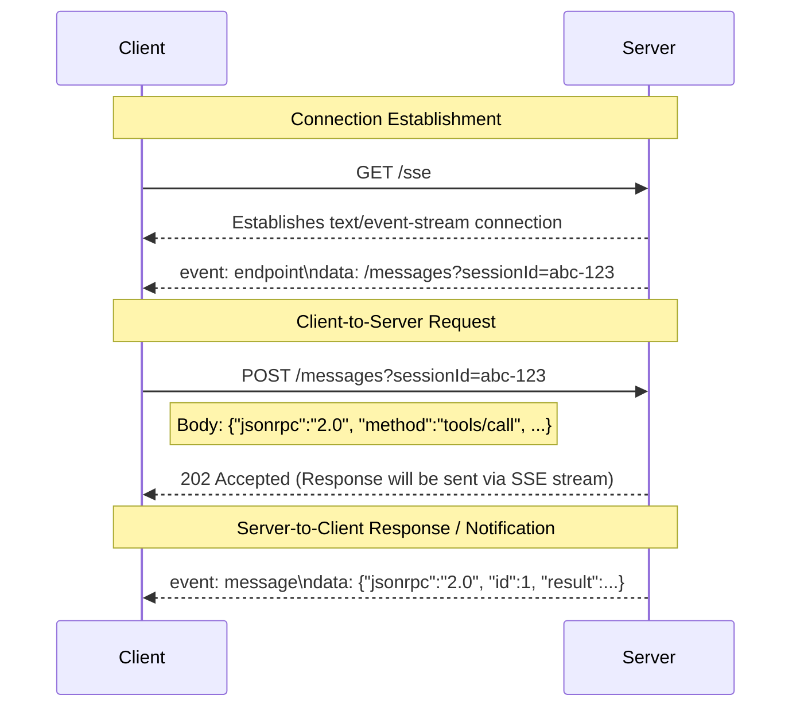

# Calculator Learning Demo - SSE (Legacy) Transport

<div align="center">

[](https://modelcontextprotocol.io)
[](https://www.typescriptlang.org/)
[](https://spec.modelcontextprotocol.io/specification/basic/transports/#http-+-sse-(legacy))
[](LICENSE)

</div>

<p align="center">
  <strong>⚠️ DEPRECATED TRANSPORT ⚠️</strong><br/>
  This repository demonstrates the legacy HTTP + SSE transport for <strong>educational purposes only</strong>.<br/>
  For new projects, please use the modern <a href="https://github.com/yigitkonur/mcp-server-examples/tree/main/streamable-http">Streamable HTTP transport</a>.
</p>

## 🎯 Overview

This repository provides a reference implementation of an MCP server using the **classic two-endpoint HTTP + Server-Sent Events (SSE) transport**. It is intentionally designed to teach the concepts, complexities, and limitations of this deprecated pattern compared to modern, single-endpoint transports.

### 🔧 Educational Echo Tool

This server includes an optional educational tool for learning MCP concepts:

- **Tool Name**: Configurable via `SAMPLE_TOOL_NAME` environment variable
- **Functionality**: Simple echo tool that demonstrates basic MCP tool patterns
- **Usage**: Set `SAMPLE_TOOL_NAME=your_tool_name` to add the tool to the server
- **Purpose**: Provides a minimal example for understanding MCP tool registration and execution

### Key Characteristics

-   **Asymmetric Channels**: Utilizes `GET /sse` for a persistent server-to-client event stream and a separate `POST /messages` endpoint for client-to-server commands.
-   **Ephemeral Session State**: Each connection establishes a new, isolated session on the server. All state (e.g., calculation history) is stored in memory and is lost when the connection closes.
-   **No Resumability**: If the SSE connection is lost, the session cannot be recovered. The client must establish a new session.
-   **Network Dependency**: Requires careful handling of network proxies and firewalls that may buffer or block SSE streams.

## 📊 Transport Comparison

This table compares the four primary MCP transport mechanisms demonstrated in the learning series. The implementation in **this repository is highlighted**.

| Dimension | STDIO | **SSE (Legacy)** | Streamable HTTP (Stateful) | Streamable HTTP (Stateless) |
|:-----------|:-----------|:---------|:---------------------|:-------------------------------|
| **Transport Layer** | Local Pipes (`stdin`/`stdout`) | ✅ **2 × HTTP endpoints (`GET`+`POST`)** | Single HTTP endpoint `/mcp` | Single HTTP endpoint `/mcp` |
| **Bidirectional Stream** | ✅ Yes (full duplex) | ⚠️ **Server→Client only** | ✅ Yes (server push + client stream) | ✅ Yes (within each request) |
| **State Management** | Ephemeral (Process Memory) | ✅ **Ephemeral (Session Memory)** | Persistent (Session State) | ❌ None (Stateless) |
| **Resumability** | ❌ None | ❌ **None** | ✅ Yes (`Last-Event-Id`) | ❌ None (by design) |
| **Scalability** | ⚠️ Single Process | ✅ **Multi-Client** | ✅ Horizontal (Sticky Sessions) | ♾️ Infinite (Serverless) |
| **Security** | 🔒 Process Isolation | 🌐 **Network Exposed** | 🌐 Network Exposed | 🌐 Network Exposed |
| **Ideal Use Case** | CLI Tools, IDE Plugins | ✅ **Legacy Web Apps** | Enterprise APIs, Workflows | Serverless, Edge Functions |

## 📐 Architecture and Flow

The legacy SSE transport pattern requires a two-step communication flow. The client first establishes a long-lived `GET` request to the `/sse` endpoint to listen for events. The server responds with a unique `sessionId`, which the client must then include as a query parameter in all subsequent `POST` requests to the `/messages` endpoint. This allows the server to route incoming commands to the correct session and event stream.



## ✨ Feature Compliance

This server implements a limited subset of the MCP Latest Standard to demonstrate the core SSE pattern. Features requiring more complex state or interaction models are stubbed or not implemented.

| Name | Status | Implementation |
|:------|:--------|:----------------|
| `calculate` | **Core ✅** | Basic arithmetic operations (`add`, `subtract`, `multiply`, `divide`, `power`, `sqrt`). |
| `batch_calculate` | **Not Implemented** | Returns JSON-RPC error `-32601 Method not found`. |
| `advanced_calculate` | **Not Implemented** | Returns JSON-RPC error `-32601 Method not found`. |
| `demo_progress` | **Extended ✅** | Simulates progress by logging to the console; designed to show how events would be pushed. |
| `explain-calculation` | **Core ✅** | Returns a Markdown explanation prompt. |
| `generate-problems` | **Core ✅** | Returns a Markdown practice problem prompt. |
| `calculator-tutor` | **Core ✅** | Returns a Markdown tutoring content prompt. |
| `solve_math_problem` | **Stub** | Returns a message: "Limited support in SSE demo". |
| `explain_formula` | **Stub** | Returns a message: "Limited support in SSE demo". |
| `calculator_assistant` | **Stub** | Returns a message: "Limited support in SSE demo". |
| `calculator://constants`| **Core ✅** | Resource for static JSON constants. |
| `calculator://history/*`| **Extended ✅** | Resource for session-specific calculation history. |
| `calculator://stats` | **Extended ✅** | Resource for session-specific usage statistics. |
| `formulas://library` | **Not Implemented** | This resource is not included in this example. |

## 🚀 Getting Started

### Prerequisites

*   Node.js (v18.x or higher)
*   npm or yarn

### Installation

```bash
# Clone the repository
git clone https://github.com/modelcontextprotocol/mcp-server-examples.git
cd mcp-server-examples/sse

# Install dependencies
npm install

# Build the project
npm run build
```

### Running the Server

```bash
# Start the server on port 1923
npm start

# Or, run in development mode with auto-reload
npm run dev
```

### Testing with MCP Inspector

You can interact with the running server using the official MCP Inspector CLI, which understands the two-endpoint SSE transport.

```bash
npx @modelcontextprotocol/inspector --cli http://localhost:1923/sse --transport sse
```

## 📋 API Usage Examples

The following `curl` examples demonstrate the required two-terminal interaction.

### 1. Connect and Establish Session

In your first terminal, establish a persistent connection to the `/sse` endpoint. This terminal will now display all events sent from the server for your session.

```bash
# In Terminal 1: Keep this running to see server-sent events
# The -N flag disables buffering, showing events as they arrive.
curl -N http://localhost:1923/sse

# Server Response:
# event: endpoint
# data: /messages?sessionId=YOUR_UNIQUE_SESSION_ID
```
Copy the `sessionId` from the response data. You will need it for the next step.

### 2. Call a Tool

In a second terminal, use the `sessionId` you just received to make a `POST` request to the `/messages` endpoint.

```bash
# In Terminal 2: Send a command
# Replace YOUR_UNIQUE_SESSION_ID with the actual ID from Terminal 1.
curl -X POST 'http://localhost:1923/messages?sessionId=YOUR_UNIQUE_SESSION_ID' \
     -H 'Content-Type: application/json' \
     -d '{
       "jsonrpc": "2.0",
       "id": 1,
       "method": "tools/call",
       "params": {
         "name": "calculate",
         "arguments": { "op": "multiply", "a": 7, "b": 6 }
       }
     }'
```

The server will respond with `202 Accepted` in Terminal 2. The actual result of the calculation will appear as a `message` event in Terminal 1.

## 🧠 State Management Model

**State is ephemeral and scoped to the SSE session.** This model is fundamental to the transport's design and limitations.

-   **Session Registry**: As seen in `src/server/index.ts`, a global `transports` object maps each `sessionId` to its active `SSEServerTransport` instance. This is the core routing mechanism.
-   **In-Memory Isolation**: Each new connection to `/sse` triggers the `createCalculatorServer()` factory, which creates a *new, isolated* `McpServer` instance. State, such as the `calculationHistory` array, is local to that instance and not shared between sessions.
-   **No Persistence**: When a client disconnects, the `transport.onclose` handler in `index.ts` fires, which removes the session from the global registry (`delete transports[sessionId]`). The server instance and all its associated in-memory state are then garbage collected.

## 🛡️ Security Model

As a network-exposed service, this transport relies on HTTP-based security patterns.

-   **Session ID**: The `sessionId` generated by `crypto.randomUUID()` acts as an ephemeral bearer token for the duration of the connection. It authenticates `POST` requests to a specific client's event stream.
-   **CORS**: The server in `src/server/index.ts` is explicitly configured with `cors()` middleware to allow cross-origin requests, which is essential for browser-based clients. The allowed origin can be restricted for production environments via the `CORS_ORIGIN` environment variable.
-   **Input Validation**: All incoming tool parameters are rigorously validated against Zod schemas defined in `src/types/calculator.ts` to prevent invalid data from causing runtime errors.
-   **No Resumability**: While a limitation, the lack of resumability also provides a security benefit: a lost or stolen `sessionId` is only useful as long as the original SSE connection is active, limiting its exposure.

## 🧪 Testing

This project includes a test suite covering the server's functionality.

```bash
# Run all tests (51 passing, 8 skipped expected)
npm test

# Run tests with code coverage report
npm run test:coverage

# Run tests in watch mode for development
npm run test:watch
```

## 📚 Official Resources

*   [MCP Specification](https://spec.modelcontextprotocol.io)
*   [Model Context Protocol Documentation](https://modelcontextprotocol.io)
*   [HTTP + SSE (Legacy) Transport Docs](https://spec.modelcontextprotocol.io/specification/basic/transports/#http-+-sse-(legacy))