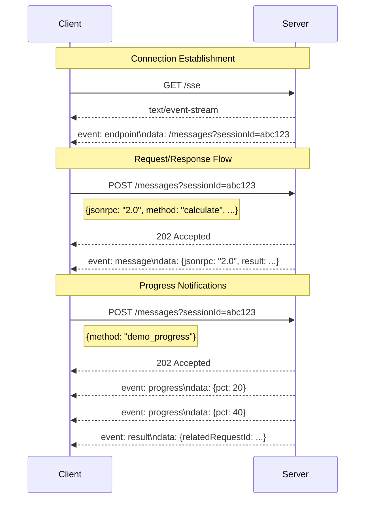

# Calculator Learning Demo - SSE Transport (Legacy)

<div align="center">

[](https://modelcontextprotocol.io)
[](https://www.typescriptlang.org/)
[](LICENSE)

</div>

<p align="center">
  <strong>⚠️ DEPRECATED TRANSPORT ⚠️</strong><br/>
  This repository demonstrates the legacy HTTP + SSE transport for educational purposes.<br/>
  For production use, please see the <a href="https://github.com/example/calculator-learning-demo-streamable-http">Streamable HTTP transport</a>.
</p>

---

## 🎯 Overview

This repository demonstrates the **classic two-endpoint SSE transport** (`GET /sse` + `POST /messages`) for MCP servers. It implements the calculator learning demo following the golden standard, but uses the deprecated SSE transport for educational purposes.

### 🚨 Why This Transport is Deprecated

The HTTP + SSE transport has several limitations:
- **Asymmetric channels**: Server-to-client uses SSE, client-to-server uses HTTP POST
- **Complex session management**: Requires manual session ID tracking
- **No resumability**: Cannot recover from disconnections
- **Limited browser support**: Some proxies and firewalls block SSE

**For new projects, use the [Streamable HTTP transport](https://github.com/example/calculator-learning-demo-streamable-http) instead.**

## 📊 Transport Comparison Table

| Feature | STDIO | HTTP + SSE (Legacy) | Streamable HTTP | WebSocket |
|---------|-------|---------------------|-----------------|-----------|
| **Connection Type** | Local process pipes | HTTP GET (SSE) + POST | Single HTTP endpoint | Persistent bidirectional |
| **Streaming** | Full duplex | Server→Client only | Full duplex | Full duplex |
| **Session Management** | Process-based | Query parameters | Headers/cookies | Connection-based |
| **Resumability** | ❌ Process restart | ❌ No support | ✅ Full support | ⚠️ Reconnect only |
| **Browser Support** | ❌ Not applicable | ⚠️ Limited | ✅ Excellent | ✅ Good |
| **Firewall Friendly** | ✅ Local only | ⚠️ Some block SSE | ✅ Standard HTTP | ⚠️ Often blocked |
| **Use Case** | CLI tools, editors | Legacy web apps | Modern web/mobile | Real-time apps |

## 🔄 SSE Transport Flow



## 📊 Golden Standard Feature Matrix

| Name | Requirement | Implementation |
|------|-------------|----------------|
| `calculate` | **Core** | One-shot JSON response for basic arithmetic operations |
| `batch_calculate` | **NOT included** | Returns JSON-RPC error `-32601` |
| `advanced_calculate` | **NOT included** | Returns JSON-RPC error `-32601` |
| `demo_progress` | **Extended** | After POST, server returns 202 Accepted. Then pushes 5 `progress` events followed by final `result` notification |
| `explain-calculation` | **Core** | Return Markdown explanation |
| `generate-problems` | **Core** | Return Markdown problems |
| `calculator-tutor` | **Core** | Return Markdown tutoring |
| `solve_math_problem` | **Optional** | Stub with `"Not supported in SSE demo"` |
| `explain_formula` | **Optional** | Stub with `"Not supported in SSE demo"` |
| `calculator_assistant` | **Optional** | Stub with `"Not supported in SSE demo"` |
| `calculator://constants` | **Core** | Static JSON constants |
| `calculator://history/{calculationId}` | **Extended** | Store history per session in memory (max 20 items) |
| `calculator://stats` | **Extended** | Return total request count & uptime |

## 🚀 Quick Start

### Prerequisites
- Node.js 18.x or higher
- npm or yarn

### Installation

```bash
# Clone the repository
git clone https://github.com/example/calculator-learning-demo-sse.git
cd calculator-learning-demo-sse

# Install dependencies
npm install

# Build the project
npm run build
```

### Running the Server

```bash
# Development mode (port 1923)
npm run dev

# Production mode (port 1923)
npm start
```

The server will start on `http://localhost:1923`

## 📋 API Examples

### Connect & Handshake

```bash
curl -N http://localhost:1923/sse
# Response:
# event: endpoint
# data: /messages?sessionId=abc123-def456-...
```

### Call Calculate Tool

```bash
curl -X POST 'http://localhost:1923/messages?sessionId=abc123' \
     -H 'Content-Type: application/json' \
     -d '{
       "jsonrpc": "2.0",
       "id": 1,
       "method": "calculate",
       "params": {
         "a": 7,
         "b": 6,
         "op": "multiply"
       }
     }'
```

### Observe Progress Demo

```bash
# In one terminal, keep the SSE connection open:
curl -N http://localhost:1923/sse

# In another terminal, trigger the progress demo:
curl -X POST 'http://localhost:1923/messages?sessionId=YOUR_SESSION_ID' \
     -H 'Content-Type: application/json' \
     -d '{
       "jsonrpc": "2.0",
       "id": 2,
       "method": "demo_progress",
       "params": {}
     }'

# Watch progress events streaming on the /sse channel
```

## 🧪 Testing

```bash
# Run all tests
npm test

# Watch mode
npm run test:watch

# Coverage report
npm run test:coverage
```

## 🔒 Security Considerations

- **Session IDs**: Generated using `crypto.randomUUID()` for security
- **CORS**: Minimal headers for cross-origin support
- **Validation**: All inputs validated with Zod schemas
- **No Resumability**: Sessions are ephemeral and lost on disconnect

## 📚 Resources

- [MCP Specification](https://spec.modelcontextprotocol.io)
- [SSE Specification](https://www.w3.org/TR/eventsource/)
- [Streamable HTTP Demo](https://github.com/example/calculator-learning-demo-streamable-http) (Recommended)

## 📝 License

MIT License - see [LICENSE](LICENSE) file for details.

---

<p align="center">
  <strong>Remember:</strong> This transport is deprecated. For new projects, use <a href="https://github.com/example/calculator-learning-demo-streamable-http">Streamable HTTP</a>.
</p>